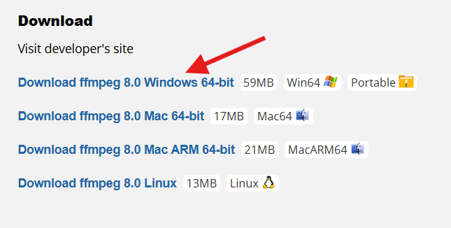
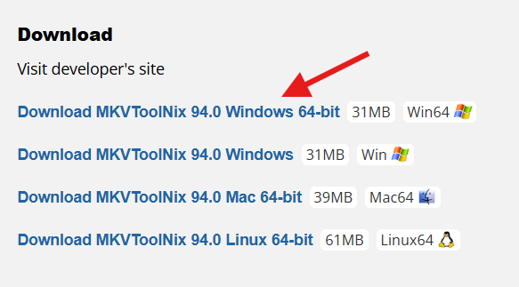
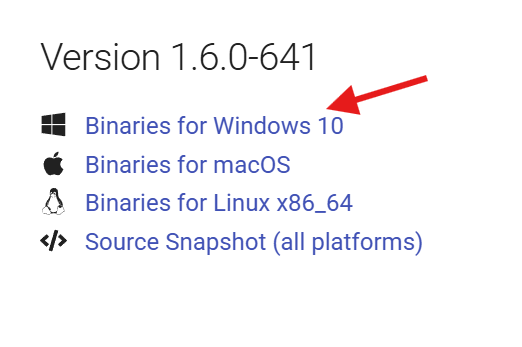
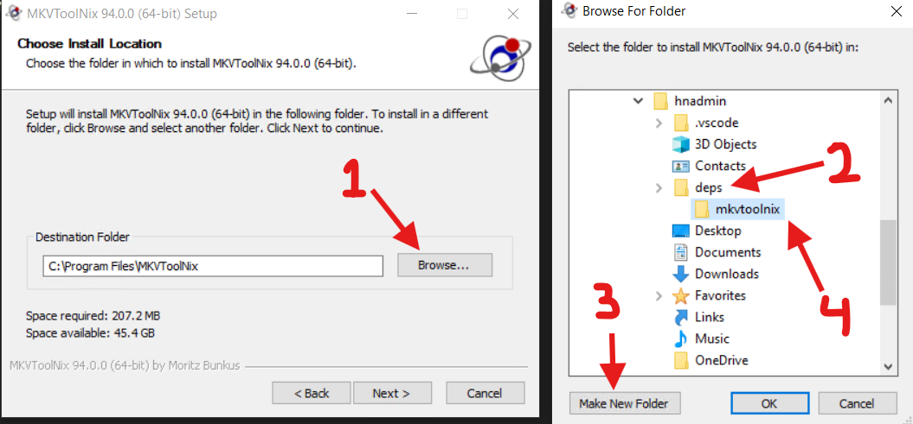
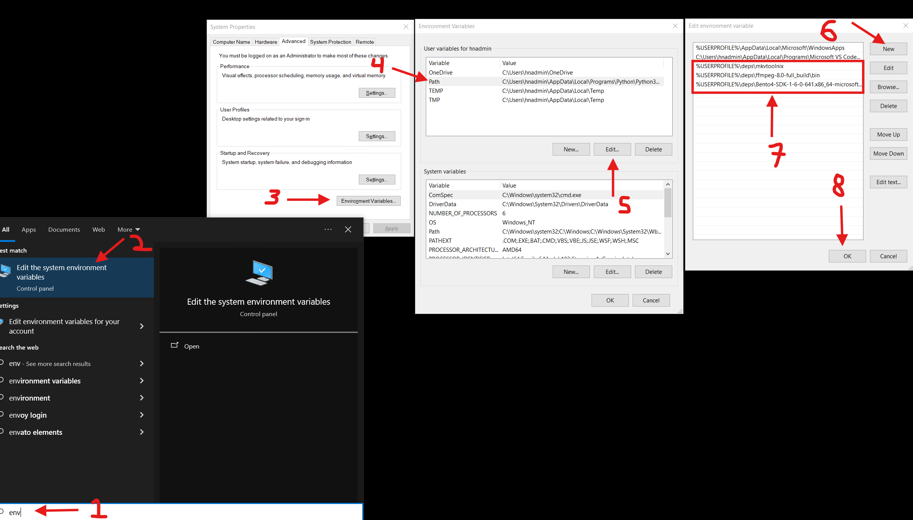
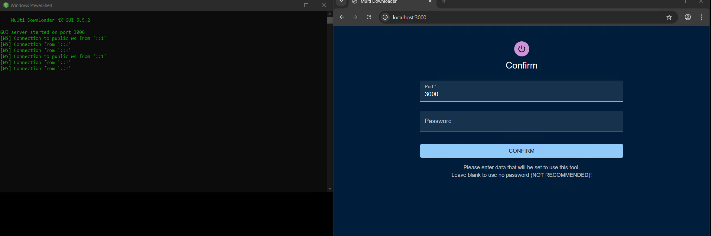
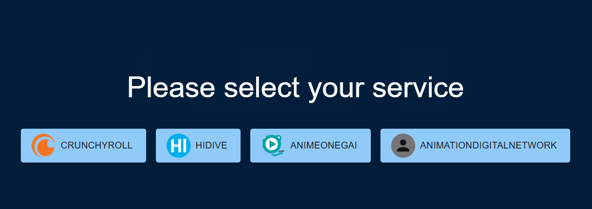
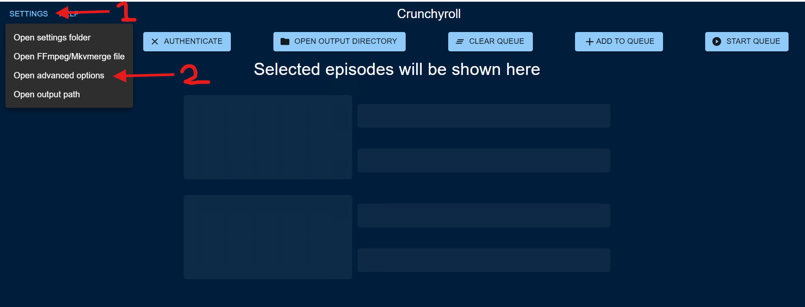
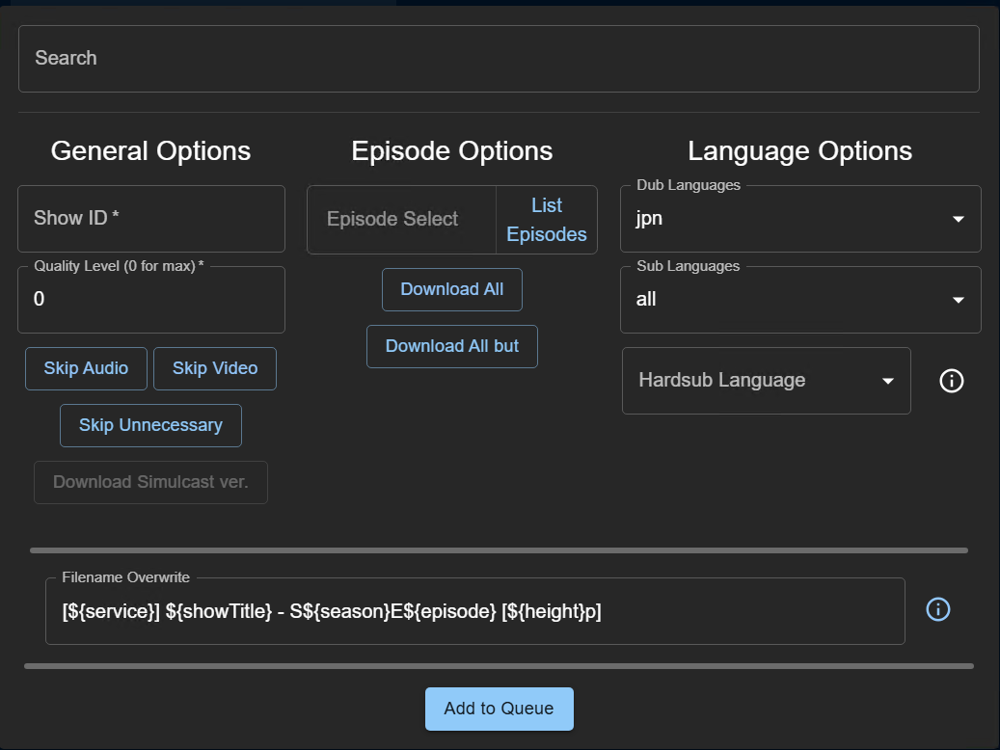
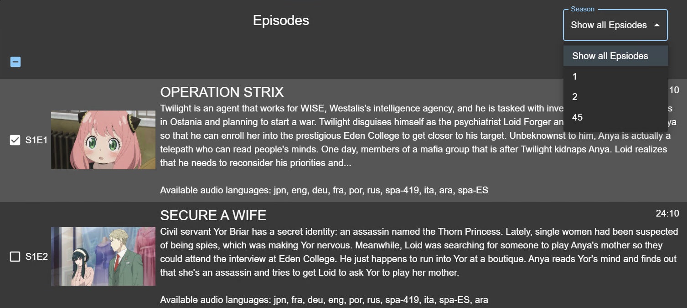

# multi-downloader-nx (v5.6.5)

If you find any bugs in this documentation or in the program itself please report it [over on GitHub](https://github.com/anidl/multi-downloader-nx/issues).

## Legal Warning

This application is not endorsed by or affiliated with *Crunchyroll*, *Hidive* or *AnimationDigitalNetwork*.
This application enables you to download videos for offline viewing which may be forbidden by law in your country.
The usage of this application may also cause a violation of the *Terms of Service* between you and the stream provider.
This tool is not responsible for your actions; please make an informed decision before using this application.

## Notes

1. Everything in this guide was done on a Windows 10 system. Windows 11 should be the same.
2. I will not be explaining how to get any CDM keys. You can find guides on the internet for that.
3. I will be showing how to setup the Bento4-SDK (mp4decrypt) option for decryption, not shaka-packager.

## Table of Contents

- [Dependencies](#dependencies)
- [CDM Setup](#cdm-setup)
    - [Widevine CDM](#widevine)
    - [Playready CDM](#playready)
- [Installation](#installation)
- [Configuration](#configuration)
- [Endpoint Notes](#endpoint-notes)
- [Usage](#usage)
    - [Authentication](#authentication)
    - [Output Directory](#output-directory)
    - [Action buttons](#action-buttons)
    - [Downloading episodes](#downloading-episodes)
        - [General options](#general-options)
        - [Episode Options](#episode-options)
        - [Language Options](#language-options)
        - [Filename Overwrite](#filename-overwrite)

## Dependencies

The dependencies for this application are:
- [ffmpeg](https://www.videohelp.com/software/ffmpeg)
- [MKVToolNix](https://www.videohelp.com/software/MKVToolNix)
- Either [Bento4-SDK (mp4decrypt)](https://www.bento4.com/downloads/) or [shaka-packager](https://github.com/stratumadev/shaka-packager/releases/latest)

For ffmpeg, i chose this option from the website: \


For MKVToolNix, i chose this option from the website: \


For Bento4-SDK, i chose this option from the website: \


Now that we have all the dependencies downloaded, we need to extract/install them and make them available in our PATH.

1. Extract all downloaded files to a folder of your choice. I chose `%USERPROFILE%\deps`.
The content of my `deps` folder looks like this:
```
C:.
│   mkvtoolnix-64-bit-94.0-setup.exe
│
├───Bento4-SDK-1-6-0-641.x86_64-microsoft-win32
│   ├───bin
│   ├───docs
│   ├───include
│   └───utils
|
├───ffmpeg-8.0-full_build
│   ├───bin
│   ├───doc
│   └───presets
```

2. Lauch the MKVToolNix installer and install it to the `%USERPROFILE%\deps\mkvtoolnix` folder. \


3. After clicking "OK", you should see the "Destination Folder" text area change to something like `C:\Users\[your username]\deps\mkvtoolnix\`. Click "Next >" then "Install" and finally "Finish".

4. Confirm that the `deps` folder now looks like this:
```
C:.
│   mkvtoolnix-64-bit-94.0-setup.exe
|
├───Bento4-SDK-1-6-0-641.x86_64-microsoft-win32
│   ├───bin
│   ├───docs
│   ├───include
│   └───utils
|
├───ffmpeg-8.0-full_build
│   ├───bin
│   ├───doc
│   └───presets
|
└───mkvtoolnix
    │   mkvextract.exe
    │   mkvinfo.exe
    │   mkvmerge.exe
    │   mkvpropedit.exe
    │   mkvtoolnix-gui.exe
    │   MKVToolNix.url
    │   uninst.exe
    │
    ├───data
    ├───doc
    ├───locale
    └───tools
```

5. If so, you may delete the `mkvtoolnix-64-bit-94.0-setup.exe` file, as it is no longer needed.

6. Now we have 3 folders to add to our PATH. The folder names after `deps` may be different for you, depending on the latest available versions. Make sure to adjust accordingly:
    - `%USERPROFILE%\deps\mkvtoolnix`
    - `%USERPROFILE%\deps\ffmpeg-8.0-full_build\bin`
    - `%USERPROFILE%\deps\Bento4-SDK-1-6-0-641.x86_64-microsoft-win32\bin`

7. Open the Start Menu and search for "Environment Variables".
8. A window called "System Properties" should open. Click on the button "Environment Variables...".
9. A window called "Environment Variables" should open. In the bottom half of the window, select the "Path" variable and click "Edit..." (or double-click the "Path" option).
10. A window called "Edit Environment Variable" should open. Click "New" and add the following paths to the list one by one:
    - `%USERPROFILE%\deps\mkvtoolnix`
    - `%USERPROFILE%\deps\ffmpeg-8.0-full_build\bin`
    - `%USERPROFILE%\deps\Bento4-SDK-1-6-0-641.x86_64-microsoft-win32\bin`
11. Click "OK" on all open windows to close them. \


12. Great! Now we have all dependencies installed and available in our PATH. To confirm that everything is working, open a new Command Prompt window and run the following commands:
```
ffmpeg
ffprobe
mkvmerge
mp4decrypt (or shaka-packager's .exe name, if you chose that instead)
```
As long as you see some output and no "command not found" errors, everything is working.

You have now completed the dependencies installation!

## CDM Setup

> [!NOTE]
> If you do not have either a Widevine or PlayReady CDM, you will get an error like "No valid Widevine or PlayReady CDM detected." when trying to download. The same error can also appear if a Widevine CDM is present but corrupted, since it will not be detected or function correctly.

### Widevine

If you have a Widevine CDM key dump, its either going to be a single `.wvd` file or a pair of `.bin` and `.pem` files. \
In any case, multi-downloader-nx supports both formats. Place them in the `widevine` folder and you are good to go.

### Playready

If you have a Playready CDM key dump, you just need to make sure:
1. Security level is either SL2000 or SL3000
2. Make sure you are using the latest version of shaka-packager from Stratuma, as he has patched it to work with multi-downloader-nx.\
   You can find his releases [here](https://github.com/stratumadev/shaka-packager/releases/latest)

File type does not matter, as multi-downloader-nx supports both `.prd` device files and the `bgroupcert.dat` and `zgpriv.dat` blobs. \
`.prd` files can be placed into the `playready` folder with whatever name it has.

But if you are using the 2 `.dat` blob files, you need to rename them like so:
- `.dat` file that is 1.xx KiB -> `bgroupcert.dat`
- `.dat` file that is 32 bytes -> `zgpriv.dat`

Output form [mediainfo](https://mediaarea.net/en/MediaInfo) can help you identify which file is which.
```
bgroupcert.dat
1.26 KiB

zgpriv.dat
32.0 Bytes
```
Keep in mind that the `bgroupcert.dat` may not always be exactly 1.26 KiB but it should be in the KiB range, while the `zgpriv.dat` will always be 32 bytes.

## Installation

1. Download the latest release of multi-downloader-nx from [here](https://github.com/anidl/multi-downloader-nx/releases/latest). Choose the `multi-downloader-nx-windows-gui.7z` file, download it and extract it to a folder of your choice. I chose `%USERPROFILE%\Desktop\multi-downloader-nx`.

2. Start `aniDL.exe` by double-clicking it. If you see a "Windows protected your PC" message, click on "More info" and then "Run anyway". You can also allow it through the Windows firewall if you see a "Windows Security Alert" window pop up. \
After that, you should see the first boot GUI of multi-downloader-nx:

If you want, you can set a password. Totally up to you. Leave blank if you dont want to. Click "CONFIRM" when you're done. \
You will see the terminal close - that is normal. Go back and launch `aniDL.exe` again, and you should see the main GUI:


## Configuration

Before we go into the usage, i would like to explain the configuration options. Aside from the configration you can do per episode(s), there are some global configuration options you can set that will apply to everything you download, without you setting them every time you go to download something. You can access said config file in 2 different ways:
- First way:
   1. When you launch the GUI, you are met with different streaming services. Click on the service you want to download from.
   2. At the top, you will see a "SETTINGS" button. Clicking on it will open a dropdown menu. From there, click on "Open advanced options". This will open the `cli-defaults.yml` file in your default text editor.
   
- Second way:
    1. In the same folder you opened `aniDL.exe` from, you should see a folder called `config`. Enter that.
    2. Double-click the `cli-defaults.yml` file to open it in your default text editor.

All available settings are available in the [`DOCUMENTATION.md`](https://github.com/anidl/multi-downloader-nx/blob/master/docs/DOCUMENTATION.md) file. In every table, there will, most of the time, be a "cli-default Entry" column with a value. If the value in the column is "NaN", that option is not available for the `cli-default.yml` file. For example, if you wanted to set `--astream` to `android`:
1. Notice how the docs say the "cli-default Entry" is `astream:`. And the "Type" column is "string". In your `cli-defaults.yml` file, you would add this line to the end of the file:
```yaml
astream: "android"
```
`astream` is the option, and `android` is the value you want to set it to. Since the "Type" column says "string", you need to put the value in quotes.

> [!NOTE]  
> The `android` endpoint (192 kb/s audio) requires a Crunchyroll "Mega Fan" or higher subscription. \
> If you are on the "Fan" subscription, set `astream` to `androidtv`. \
> With "Mega Fan" or higher, both `android` and `androidtv` work.

Pretty simple, right? You can set any option you want in this file. Just make sure to follow the YAML syntax. Strings need to be in quotes, arrays need to be in square brackets and each entry needs to be separated by a comma, booleans are either "true" or "false" without any quotes - just the word as-is. If you want to set a list with only one entry, it still needs to be in square brackets.

For example, if you wanted to set `--dubLang`to only `eng`, you would do it like this:

```yaml
dubLang: ["eng"]
```

If you wanted to set it to both `jpn` and `eng`, you would do it like this:

```yaml
dubLang: ["jpn", "eng"]
```

If you wanted to set `--tsd` to `true`, you would do it like this:

```yaml
tsd: true
```

## Endpoint Notes

This section explains what each endpoint is capable of, and what subscription level is required to use it. \
If you are new to the project, please use the defaults found in the [`cli-defaults.yml`](https://github.com/HyperNylium/multi-downloader-nx/blob/master/config/cli-defaults.yml) file, as those are the recommended settings.

| Endpoint     | Video quality               | Audio quality | Subscription level required |
|--------------|-----------------------------|---------------|-----------------------------|
| `android`    | 4-6k variable bitrate (VBR) | 192kbps       | "Fan" or higher             |
| `androidtab` | 4-6k variable bitrate (VBR) | 128kbps       | "Fan" or higher             |
| `androidtv`  | 8k constent bitrate (CBR)   | 128kbps       | "Fan" or higher             |

> [!NOTE]
> If you pick 192kbps audio (`--astream android`) with 8k CBR video (`--vstream androidtv`) but don’t have "Mega Fan" sub or higher,
> the audio will fall back to 128 kbps, which will download the CBR video with 128 kbps audio.

> [!NOTE]
> 192 kbps audio comes from the `android` endpoint. CBR video comes from `androidtv` endpoint. \
> Using both means you are using **two streams**, which needs the "Mega Fan" tier or higher.

## Usage

### Authentication

To use multi-downloader-nx, you will need to authenticate with the streaming service you want to download from. This is done by logging in with your account credentials.

1. After choosing the streaming service you want to download from, at the top of the browser window, you will see a "AUTHENTICATE" button. Click on it.
2. A new window will open, asking you to log in. Enter your username and password and click on "Authenticate" once ready. 

You will see an error message if things dont work out. You can look at the terminal window for more details as to why it failed.

### Output Directory

Setting an output directory is not required, as it will download to the `videos` folder in the same directory you opened `aniDL.exe` by default. However, if you want to change it, follow these steps:

1. At the top of the browser windows you will see a "SETTINGS" button. Clicking on it will open a dropdown menu. From there, click on "Open settings folder" options. This will open the folder in explorer.
2. Double-click the `dir-path.yml` file to open it in your default text editor.
3. Change the path in the `content:` entry to your desired output directory. Make sure to single forward slashes (`/`) in the path. For example:
```yaml
content: D:/Plex/Anime/
fonts: ./fonts/
```
4. Save the file and close it.

### Action buttons

When downloading episodes, if you find that you need to pause the downloads, click on the "STOP QUEUE" button at the top right. This will be "START QUEUE" if nothing is downloading. To undo, simply click on it again.

If you want to clear the current queue, click on the "CLEAR QUEUE" button at the top. This will remove all episodes from the queue that are not currently downloading. There is no undo for this action, so be careful.

### Downloading episodes

At the top right, you will see a button called "ADD TO QUEUE", which will open something like this:


One note before we start: Any settings made on this window will not be saved for other downloads - the changes will only apply to the current series/episodes you are downloading. \
For example, if you modify "Filename overwrite" to be something else, the next time you open the window, it will be back to the default value. If you want to change the default values, please refer to the [Configuration](#configuration) section.

Alright, lets start at the top left and go down from there. I will only be explaining the GUI specific stuff like Show ID, Search, etc. For the rest of the options, please refer to the `DOCUMENTATION.md` file, as these are already explained very well there.

#### General options

1. **Search**: This is where you enter the name of the show you want to download from. You can enter either the full name or just a part of it (although for best results, i would suggest entering the full name). For example, if you want to download from "Spy X Family", just type into the box "spy x fam". After entering the name, you should see results coming in and populate the menu with the results. If not, press your `enter` key and things should work. After the results have loaded, select the show you want to download by clicking on it. It will populate the "Show ID" field with the ID of the show you selected. If you use this method, leave the "Show ID" as is.

2. **Show ID**: This is where you enter the ID of the show you want to download from. You can find the ID of the series in the URL. For example, if you want to download from "Spy X Family", the URL would look like this:
```
https://www.crunchyroll.com/series/G4PH0WXVJ/spy-x-family
```
The ID is the part after `/series/`, so in this case, it would be `G4PH0WXVJ`.
If you wanted to download the show via the ID, you would enter `G4PH0WXVJ` in the "Show ID" field and leave the "Search" field blank.

#### Episode Options

1. **Episode Select**: After the "Show ID" field is populated, either by using the "Search" field or by entering the ID manually, you will be able to click on the "List Episodes" button. This will fetch the list of episodes for the show you selected and populate the "Episodes" menu with them. You can then select the episodes you want to download by clicking on them, or filtering episodes by their seasons from the top right. After selecting the episodes you want to download, you will see the "Episode Select" field populate with the selected episodes. You can also manually enter the episodes you want to download in the "Episode Select" field, using commas to separate them. For example, if you want to download episodes 1, 2, 5 and 8, you would enter `,1,2,5,8` in the "Episode Select" field. Special episodes has an `S` infront of them. So, if you were downloading a movie, that movie could be `S1`.


2. **Download All**: This will override the "Episode Select" field and download all episodes of the show.
3. **Download All But**: This will download every episode in the series except for the ones you enter in the "Episode Select" field.

#### Language Options

1. **Dub Languages**: This is where you select the language(s) you want to download the dub for. [`DOCUMENTATION.md`](https://github.com/anidl/multi-downloader-nx/blob/master/docs/DOCUMENTATION.md#--dublang) for all available options.
2. **Sub Languages**: This is where you select the language(s) you want to download the subs for. [`DOCUMENTATION.md`](https://github.com/anidl/multi-downloader-nx/blob/master/docs/DOCUMENTATION.md#--dlsubs) for all available options.

#### Filename Overwrite

1. **Filename Overwrite**: This is where you can change the filename format for the downloaded episodes. [`DOCUMENTATION.md`](https://github.com/anidl/multi-downloader-nx/blob/master/docs/DOCUMENTATION.md#--filename) for all available options.
